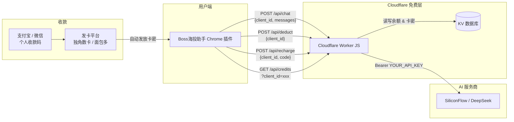

# Boss 海投助手 — 商业化改造完整方案

> **目标**：将本地浏览器插件 `boss-extension` 改造为可售卖产品。内置开发者 API Key，通过 Cloudflare Workers 安全代理 AI 请求，使用卡密模式（支付宝/微信收款）按投递岗位数计费。
>
> **定价**：10 元 / 100 个岗位投递额度，新用户免费赠送 10 个岗位试用。

---

## 一、整体架构



### 计费模型

| 项目 | 说明 |
|------|------|
| **计费单位** | 每成功投递 1 个岗位 = 扣 1 点额度 |
| **AI 调用不单独计费** | 匹配评分、招呼语生成、自动回复等 AI 调用不扣额度，只有最终投递成功才扣 |
| **新用户赠送** | 首次使用自动赠送 10 点（可投递 10 个岗位） |
| **充值面额** | 10 元 = 100 点（可投递 100 个岗位） |

### 安全保障

| 风险 | 防护方式 |
|------|---------|
| API Key 泄露 | Key 仅存储在 Cloudflare 环境变量中，插件端永远接触不到 |
| 白嫖调用 | 每次 AI 请求都先查余额，余额 ≤ 0 直接拒绝（HTTP 403） |
| 抓包逆向 | 用户抓包只能看到向你的 `.workers.dev` 域名发送请求，无法获取 AI Key |
| 插件代码被复制 | 复制后仍然只能向你的后端发请求，没有额度照样用不了 |

---

## 二、Cloudflare Workers 后端（需新建的文件）

### 2.1 项目结构

```
boss-worker/
├── wrangler.toml          # Cloudflare 配置
├── src/
│   └── index.js           # Worker 入口（所有 API 逻辑）
├── scripts/
│   └── generate-cards.js  # 本地脚本：批量生成卡密并写入 KV
└── package.json
```

### 2.2 `wrangler.toml` 配置

```toml
name = "boss-helper-api"
main = "src/index.js"
compatibility_date = "2024-01-01"

[vars]
AI_API_URL = "https://api.siliconflow.cn/v1/chat/completions"
AI_MODEL   = "deepseek-ai/DeepSeek-V2.5"
# AI_API_KEY 通过 wrangler secret 设置，不写在文件中
# 执行命令: wrangler secret put AI_API_KEY

[[kv_namespaces]]
binding = "BOSS_KV"
id = "<在 Cloudflare 控制台创建后填入>"
```

### 2.3 `src/index.js` — Worker 完整逻辑

```js
// ===== Boss海投助手 Cloudflare Worker 后端 =====

const CORS_HEADERS = {
  'Access-Control-Allow-Origin': '*',
  'Access-Control-Allow-Methods': 'GET, POST, OPTIONS',
  'Access-Control-Allow-Headers': 'Content-Type',
};

// 新用户免费试用额度（可投递 10 个岗位）
const FREE_CREDITS = 10;

export default {
  async fetch(request, env) {
    if (request.method === 'OPTIONS') {
      return new Response(null, { headers: CORS_HEADERS });
    }

    const url = new URL(request.url);
    const path = url.pathname;

    try {
      if (path === '/api/credits' && request.method === 'GET') {
        return await handleQueryCredits(url, env);
      }
      if (path === '/api/recharge' && request.method === 'POST') {
        return await handleRecharge(request, env);
      }
      if (path === '/api/chat' && request.method === 'POST') {
        return await handleChat(request, env);
      }
      if (path === '/api/deduct' && request.method === 'POST') {
        return await handleDeduct(request, env);
      }
      return jsonResponse({ error: 'Not Found' }, 404);
    } catch (e) {
      return jsonResponse({ error: e.message || 'Internal Error' }, 500);
    }
  }
};

// ── 获取或初始化用户数据 ──
async function getOrCreateUser(env, clientId) {
  let userData = await env.BOSS_KV.get('user:' + clientId, 'json');
  if (!userData) {
    userData = { credits: FREE_CREDITS, total_delivered: 0, created: Date.now() };
    await env.BOSS_KV.put('user:' + clientId, JSON.stringify(userData));
  }
  return userData;
}

// ── 查询余额 ──
async function handleQueryCredits(url, env) {
  const clientId = url.searchParams.get('client_id');
  if (!clientId) return jsonResponse({ error: '缺少 client_id' }, 400);

  const userData = await getOrCreateUser(env, clientId);
  return jsonResponse({
    credits: userData.credits,
    total_delivered: userData.total_delivered || 0
  });
}

// ── 卡密充值 ──
async function handleRecharge(request, env) {
  const body = await request.json();
  const { client_id, code } = body;
  if (!client_id || !code) return jsonResponse({ error: '缺少参数' }, 400);

  // 1. 查询卡密
  const cardKey = 'card:' + code.trim();
  const cardData = await env.BOSS_KV.get(cardKey, 'json');
  if (!cardData) return jsonResponse({ error: '无效的充值码' }, 400);
  if (cardData.used) return jsonResponse({ error: '该充值码已被使用' }, 400);

  // 2. 标记卡密已使用
  cardData.used = true;
  cardData.used_by = client_id;
  cardData.used_at = Date.now();
  await env.BOSS_KV.put(cardKey, JSON.stringify(cardData));

  // 3. 给用户加额度
  const userData = await getOrCreateUser(env, client_id);
  userData.credits += cardData.credits;
  await env.BOSS_KV.put('user:' + client_id, JSON.stringify(userData));

  return jsonResponse({
    success: true,
    message: '充值成功！已增加 ' + cardData.credits + ' 个岗位投递额度',
    credits: userData.credits
  });
}

// ── AI 代理请求（只检查余额，不扣费）──
async function handleChat(request, env) {
  const body = await request.json();
  const { client_id, messages, max_tokens, temperature } = body;
  if (!client_id) return jsonResponse({ error: '缺少 client_id' }, 400);
  if (!messages || !messages.length) return jsonResponse({ error: '缺少 messages' }, 400);

  // 1. 检查余额（仅检查，不扣减。扣减在投递成功后由 /api/deduct 完成）
  const userData = await getOrCreateUser(env, client_id);
  if (userData.credits <= 0) {
    return jsonResponse({
      error: '余额不足，请充值后再使用。当前可投递岗位数：0',
      credits: 0,
      need_recharge: true
    }, 403);
  }

  // 2. 向 AI 服务商发起请求
  const aiResp = await fetch(env.AI_API_URL, {
    method: 'POST',
    headers: {
      'Content-Type': 'application/json',
      'Authorization': 'Bearer ' + env.AI_API_KEY
    },
    body: JSON.stringify({
      model: env.AI_MODEL,
      messages,
      max_tokens: max_tokens || 500,
      temperature: temperature || 0.5
    })
  });

  if (!aiResp.ok) {
    const errText = await aiResp.text().catch(() => '');
    return jsonResponse({ error: 'AI 服务异常: ' + aiResp.status + ' ' + errText.slice(0, 200) }, 502);
  }

  const aiData = await aiResp.json();
  if (aiData.error) {
    return jsonResponse({ error: 'AI 返回错误: ' + (aiData.error.message || JSON.stringify(aiData.error)) }, 502);
  }

  // 3. 返回 AI 响应 + 当前余额（不扣减）
  return jsonResponse({
    choices: aiData.choices,
    usage: aiData.usage,
    credits_remaining: userData.credits
  });
}

// ── 投递成功后扣费（每成功投递 1 个岗位扣 1 点）──
async function handleDeduct(request, env) {
  const body = await request.json();
  const { client_id } = body;
  if (!client_id) return jsonResponse({ error: '缺少 client_id' }, 400);

  const userData = await getOrCreateUser(env, client_id);
  if (userData.credits <= 0) {
    return jsonResponse({ error: '余额不足', credits: 0, need_recharge: true }, 403);
  }

  userData.credits -= 1;
  userData.total_delivered = (userData.total_delivered || 0) + 1;
  await env.BOSS_KV.put('user:' + client_id, JSON.stringify(userData));

  return jsonResponse({
    success: true,
    credits: userData.credits,
    total_delivered: userData.total_delivered
  });
}

// ── 工具函数 ──
function jsonResponse(data, status = 200) {
  return new Response(JSON.stringify(data), {
    status,
    headers: { 'Content-Type': 'application/json', ...CORS_HEADERS }
  });
}
```

### 2.4 `scripts/generate-cards.js` — 批量生成卡密

```js
// 使用方法（本地终端执行）:
// node scripts/generate-cards.js [数量] [每张额度]
// 例: node scripts/generate-cards.js 50 100
//     → 生成 50 张卡密，每张可投递 100 个岗位（对应 10 元面额）

const crypto = require('crypto');
const count = parseInt(process.argv[2]) || 10;
const credits = parseInt(process.argv[3]) || 100;

console.log('# 批量生成卡密 (' + count + ' 张，每张 ' + credits + ' 个岗位额度)');
console.log('# ── wrangler 写入命令 ──\n');

const cards = [];
for (let i = 0; i < count; i++) {
  const code = 'BOSS-' + crypto.randomBytes(4).toString('hex').toUpperCase();
  const value = JSON.stringify({ credits, used: false });
  console.log(`wrangler kv:key put --namespace-id=<你的KV_ID> "card:${code}" '${value}'`);
  cards.push(code);
}

console.log('\n# ── 卡密列表（复制到发卡平台作为库存，一行一个） ──');
cards.forEach(c => console.log(c));
```

### 2.5 部署步骤（逐条可执行命令）

```bash
# 1. 安装 Cloudflare CLI
npm install -g wrangler

# 2. 登录 Cloudflare（会打开浏览器授权）
wrangler login

# 3. 创建项目目录
mkdir boss-worker && cd boss-worker
npm init -y

# 4. 把上面 2.2 的 wrangler.toml 和 2.3 的 src/index.js 放到对应位置

# 5. 创建 KV 命名空间
wrangler kv:namespace create BOSS_KV
# 命令输出会给你一个 id，如: id = "abc123def456"
# 把这个 id 填入 wrangler.toml 的 [[kv_namespaces]] 里

# 6. 设置 API Key 密钥（不会出现在代码中）
wrangler secret put AI_API_KEY
# 终端会提示你输入密钥值，粘贴你的 SiliconFlow/DeepSeek API Key

# 7. 本地测试
wrangler dev
# 启动后用 curl 验证：
# curl http://localhost:8787/api/credits?client_id=test_user
# 预期返回: {"credits":10,"total_delivered":0}

# 8. 部署到线上
wrangler deploy
# 部署成功后会输出你的 Worker URL，如:
# https://boss-helper-api.<你的子域名>.workers.dev

# 9. 生成卡密
node scripts/generate-cards.js 50 100
# 执行输出的 wrangler kv:key put 命令
```

---

## 三、插件端改造（修改现有文件）

### 3.1 需修改的文件清单

| 文件 | 改动内容 |
|------|---------|
| `manifest.json` | 移除第三方 AI 域名的 `host_permissions`，加入你的 Worker 域名 |
| `sidepanel.html` | 删除「② AI 配置」面板 → 替换为「② 额度与充值」面板；删除桌面桥接 UI；删除 JD分析/模拟面试/周报按钮 |
| `sidepanel.js` | 删除 AI 配置存取逻辑；新增 client_id 生成/充值/余额查询；删除桌面桥接、JD分析、周报代码 |
| `background.js` | `callAI()` 改为请求 Worker `/api/chat`；投递成功后调 `/api/deduct` 扣费；删除桌面桥接 |
| `content-chat.js` | AI 自动回复改为委托 `background.js` 统一走 Worker |

### 3.2 `manifest.json` 改动

```diff
  "host_permissions": [
    "*://*.zhipin.com/*",
-   "https://api.deepseek.com/*",
-   "https://api.openai.com/*",
-   "https://api.siliconflow.cn/*",
-   "https://ark.cn-beijing.volces.com/*",
-   "https://spark-api-open.xf-yun.com/*"
+   "https://boss-helper-api.<你的子域名>.workers.dev/*"
  ],
```

### 3.3 `sidepanel.html` 改动

**删除** 第 42~64 行（整个 `② AI 配置` section），**替换为**：

```html
<!-- ② 额度与充值 -->
<section class="card">
  <div class="card-h" data-toggle="creditCfg"><span>② 额度与充值</span><span class="chev">▾</span></div>
  <div class="card-b" id="creditCfg">
    <label>设备 ID</label>
    <div style="display:flex;gap:4px;align-items:center;">
      <input type="text" id="clientId" readonly style="flex:1;background:#f5f5f5;font-size:11px;">
      <button class="btn-sm" id="copyClientId">复制</button>
    </div>

    <div style="margin:12px 0;padding:16px;background:linear-gradient(135deg,#e8f5e9,#f1f8e9);border-radius:10px;text-align:center;">
      <div style="font-size:13px;color:#555;">可投递岗位数</div>
      <b id="creditsDisplay" style="font-size:32px;color:#2e7d32;line-height:1.5;">--</b>
      <div style="font-size:11px;color:#888;margin-top:2px;">已累计投递 <b id="totalDelivered">0</b> 个岗位</div>
    </div>

    <label>卡密充值</label>
    <div style="display:flex;gap:4px;">
      <input type="text" id="rechargeCode" placeholder="输入充值码，如 BOSS-A1B2C3D4" style="flex:1;">
      <button class="btn-sm" id="rechargeBtn" style="background:#4285f4;color:#fff;">充值</button>
    </div>

    <a href="https://你的发卡网链接.com" target="_blank"
       style="display:block;text-align:center;margin-top:10px;padding:10px;
              background:linear-gradient(135deg,#ff9800,#ff5722);border-radius:8px;color:#fff;
              text-decoration:none;font-weight:bold;font-size:13px;">
      💰 购买额度 — ¥10 / 100个岗位
    </a>
  </div>
</section>
```

**同时删除以下 UI 元素**：

| 位置 | 删除内容 |
|------|---------|
| 第 58~63 行 | `桌面桥接（127.0.0.1:5001）` 开关和 `desktopStatus` 状态显示 |
| 第 148~153 行 | `导入文件（需桌面端运行）` 按钮区域 |
| 第 183~185 行 | `📈 JD需求分析` / `🎯 模拟面试` / `📊 周报` 三个按钮 |

### 3.4 `sidepanel.js` 改动

#### a) 文件顶部：新增 Worker 地址 + client_id 管理

```js
// ===== 新增：Worker 后端地址 =====
const API_BASE = 'https://boss-helper-api.<你的子域名>.workers.dev';

async function getClientId() {
  const data = await chrome.storage.local.get('clientId');
  if (data.clientId) return data.clientId;
  const id = 'usr_' + crypto.randomUUID().replace(/-/g, '').slice(0, 12);
  await chrome.storage.local.set({ clientId: id });
  return id;
}
```

#### b) 新增余额查询 + 充值 + 复制 ID

```js
// 查询余额
async function refreshCredits() {
  const clientId = await getClientId();
  try {
    const resp = await fetch(API_BASE + '/api/credits?client_id=' + clientId);
    const data = await resp.json();
    $('creditsDisplay').textContent = data.credits ?? '--';
    $('totalDelivered').textContent = data.total_delivered ?? 0;
  } catch (e) {
    $('creditsDisplay').textContent = '网络错误';
  }
}

// 卡密充值
$('rechargeBtn').addEventListener('click', async () => {
  const code = $('rechargeCode').value.trim();
  if (!code) return addLog('请输入充值码', 'warn');
  const clientId = await getClientId();
  $('rechargeBtn').disabled = true;
  $('rechargeBtn').textContent = '充值中...';
  try {
    const resp = await fetch(API_BASE + '/api/recharge', {
      method: 'POST',
      headers: { 'Content-Type': 'application/json' },
      body: JSON.stringify({ client_id: clientId, code })
    });
    const data = await resp.json();
    if (data.success) {
      addLog(data.message, 'success');
      $('creditsDisplay').textContent = data.credits;
      $('rechargeCode').value = '';
    } else {
      addLog('充值失败: ' + data.error, 'error');
    }
  } catch (e) {
    addLog('网络错误: ' + e.message, 'error');
  }
  $('rechargeBtn').disabled = false;
  $('rechargeBtn').textContent = '充值';
});

// 复制设备 ID
$('copyClientId').addEventListener('click', () => {
  navigator.clipboard.writeText($('clientId').value);
  addLog('已复制设备 ID', 'success');
});
```

#### c) 删除以下代码块

| 行号范围（约） | 删除内容 | 原因 |
|---------------|---------|------|
| 第 4~6 行 CFG_KEYS 中 | `'aiApiKey', 'aiApiUrl', 'aiModel'` | 不再由用户配置 |
| 第 11 行 CFG_KEYS 中 | `'useDesktopBridge'` | 砍掉桌面桥接 |
| 第 26~31 行 | 预设按钮事件监听（DeepSeek/OpenAI/硅基流动） | AI 配置面板已删 |
| 第 433~478 行 | `$('btnJdAnalysis')` 事件监听 | 砍掉 JD 分析 |
| 第 694~733 行 | `analyzeJD()` 函数 | 依赖桌面端，已删 |
| 第 813~841 行 | `$('btnReport')` 事件监听 | 砍掉周报 |
| 第 843~872 行 | `checkDesktopBridge()` 和桌面桥接事件监听 | 砍掉桌面桥接 |
| 第 488~490 行 loadCfg | `aiApiKey / aiApiUrl / aiModel` 读取 | 不再需要 |
| 第 509 行 loadCfg | `useDesktopBridge` 读取 | 不再需要 |
| 第 537~539 行 saveCfg | `aiApiKey / aiApiUrl / aiModel` 保存 | 不再需要 |
| 第 554 行 saveCfg | `useDesktopBridge` 保存 | 不再需要 |

#### d) 新增：监听余额更新消息

在 `chrome.runtime.onMessage.addListener` 回调中新增：

```js
if (msg.type === 'CREDITS_UPDATE') {
  $('creditsDisplay').textContent = msg.credits;
  if (typeof msg.total_delivered === 'number') {
    $('totalDelivered').textContent = msg.total_delivered;
  }
}
```

#### e) 修改初始化（文件末尾）

```js
// 删除原来的:
// loadCfg();
// updateDashboard();
// checkDesktopBridge().then(ok => { if (ok) { syncFromDesktop(); startAgentPolling(); } });

// 替换为:
loadCfg();
updateDashboard();
(async () => {
  const clientId = await getClientId();
  $('clientId').value = clientId;
  await refreshCredits();
})();
```

### 3.5 `background.js` 改动

#### a) 顶部新增 Worker 地址

```js
const API_BASE = 'https://boss-helper-api.<你的子域名>.workers.dev';
```

#### b) 重写 `callAI()` 函数（替换第 177~207 行）

```js
// ── AI 调用（通过 Worker 代理，仅检查余额不扣费）──
async function callAI(cfg, messages, maxTokens) {
  const clientIdData = await chrome.storage.local.get('clientId');
  const clientId = clientIdData.clientId || 'unknown';
  log('  [AI] 通过 Worker 代理发起请求...');

  const resp = await fetch(API_BASE + '/api/chat', {
    method: 'POST',
    headers: { 'Content-Type': 'application/json' },
    body: JSON.stringify({
      client_id: clientId,
      messages,
      max_tokens: maxTokens || 500,
      temperature: 0.5
    })
  });

  const data = await resp.json();

  if (data.need_recharge) {
    throw new Error('余额不足，请充值后再使用');
  }
  if (!resp.ok) {
    throw new Error('AI 请求失败: ' + (data.error || resp.status));
  }
  if (!data.choices || !data.choices[0] || !data.choices[0].message) {
    throw new Error('AI 响应格式异常');
  }

  return data.choices[0].message.content || '';
}
```

#### c) 简化 `callAISmart()`（替换第 289~300 行）

```js
async function callAISmart(cfg, messages, maxTokens) {
  return callAI(cfg, messages, maxTokens);
}
```

#### d) 投递成功后调用 `/api/deduct` 扣费

在 `runDeliver()` 函数中，找到投递成功的分支（约第 734 行 `if (r2 && r2.success)`），在 `RiskManager.onSuccess()` 之后新增：

```js
// ===== 新增：投递成功后扣除 1 点额度 =====
try {
  const clientIdData = await chrome.storage.local.get('clientId');
  const deductResp = await fetch(API_BASE + '/api/deduct', {
    method: 'POST',
    headers: { 'Content-Type': 'application/json' },
    body: JSON.stringify({ client_id: clientIdData.clientId })
  });
  const deductData = await deductResp.json();
  if (deductData.success) {
    chrome.runtime.sendMessage({
      type: 'CREDITS_UPDATE',
      credits: deductData.credits,
      total_delivered: deductData.total_delivered
    }).catch(() => {});
    log('  额度 -1，剩余 ' + deductData.credits + ' 个岗位');
  }
} catch (e) { /* 扣费失败不影响投递结果 */ }
```

#### e) 删除以下代码块

| 行号范围（约） | 删除内容 | 原因 |
|---------------|---------|------|
| 第 112 行 getCfg | `'aiApiKey', 'aiApiUrl', 'aiModel'` | Worker 管理 |
| 第 114 行 getCfg | `'useDesktopBridge'` | 桌面桥接已删 |
| 第 402~430 行 | `desktopProxy()` 函数 | 桌面桥接已删 |
| 第 741~751 行 | 投递成功后 `fetch('http://127.0.0.1:5001/...')` 同步桌面数据库 | 桌面桥接已删 |

#### f) 新增消息处理：AI_CHAT_REQUEST

在消息入口 `chrome.runtime.onMessage.addListener`（第 791 行）中新增，供 `content-chat.js` 委托 AI 调用：

```js
if (msg.type === 'AI_CHAT_REQUEST') {
  (async () => {
    try {
      const cfg = await getCfg();
      const result = await callAI(cfg, msg.messages, msg.max_tokens || 150);
      sendResponse({ success: true, content: result });
    } catch (e) {
      sendResponse({ success: false, error: e.message });
    }
  })();
  return true; // 保持 sendResponse 异步通道
}
```

### 3.6 `content-chat.js` 改动

原本第 283~296 行直接向 AI 服务商发送 `fetch` 请求，改为委托给 `background.js`：

```js
// ── 替换原来的直连 AI fetch 代码 ──
// 原代码:
// const resp = await fetch(apiUrl, {
//   headers: { 'Authorization': 'Bearer ' + cfg.aiApiKey }, ...
// });

// 替换为:
const aiResult = await new Promise((resolve) => {
  chrome.runtime.sendMessage({
    type: 'AI_CHAT_REQUEST',
    messages: [
      { role: 'system', content: sys },
      { role: 'user', content: 'HR说：' + text + '\n\n请回复：' }
    ],
    max_tokens: 150
  }, (resp) => resolve(resp));
});

if (!aiResult || !aiResult.success) {
  chrome.runtime.sendMessage({
    type: 'CONTENT_LOG',
    text: '💬 [自动回复] AI 错误: ' + (aiResult?.error || '未知错误'),
    level: 'error'
  }).catch(() => {});
  return;
}
const reply = aiResult.content;
```

同时修改 `setupAutoReply()` 中的配置读取（第 247 行），移除对 `aiApiKey` 的依赖：

```diff
- chrome.storage.local.get(['autoReply', 'aiApiKey', 'aiApiUrl', 'aiModel', 'aiRole'], res);
+ chrome.storage.local.get(['autoReply', 'aiRole'], res);
```

```diff
- if (!cfg.autoReply || !cfg.aiApiKey) {
+ if (!cfg.autoReply) {
```

---

## 四、收款方案（支付宝/微信 → 卡密自动发货）

### 4.1 推荐平台

| 平台 | 免签支付宝/微信 | 手续费 | 适合场景 |
|------|:----:|------|---------|
| **面包多** (mianbaoduo.com) | ✅ | 3.5% | 零配置，注册即用，最简单 |
| **独角数卡** (dujiaoka) | ✅ | 0%（自部署） | 有 VPS 的开发者 |
| **闲鱼 / 微店** | ✅ | 0~1% | 最简单但需手动发货 |

### 4.2 操作流程（以面包多为例）

1. 注册面包多账号 → 绑定个人支付宝/微信收款
2. 创建商品：
   - 名称：`Boss海投助手 额度充值 (100个岗位)`
   - 价格：`10 元`
   - 发货方式：**卡密自动发货**
   - 库存：把 `generate-cards.js` 生成的卡密列表粘贴进去，一行一个
3. 买家付款 → 自动收到卡密 → 在插件输入充值 → 开始海投

### 4.3 卡密生成与上架

```bash
# 1. 生成 50 张卡密（每张 100 个岗位额度，对应 10 元面额）
node scripts/generate-cards.js 50 100

# 2. 执行输出的 wrangler kv:key put 命令（写入 KV 数据库）

# 3. 把输出的卡密列表复制到面包多商品的库存栏中
```

---

## 五、验收检查清单

### 5.1 后端验收

- [ ] `wrangler login` 成功登录 Cloudflare
- [ ] `wrangler kv:namespace create BOSS_KV` 成功，ID 已填入 `wrangler.toml`
- [ ] `wrangler secret put AI_API_KEY` 已设置 AI 密钥
- [ ] `wrangler dev` 启动后，以下四个接口均正常：
  - [ ] `GET /api/credits?client_id=test` → 返回 `{"credits":10,"total_delivered":0}`（新用户赠送 10 个岗位）
  - [ ] `POST /api/chat` 传入有效 messages → 返回 AI 响应（不扣额度）
  - [ ] `POST /api/deduct` → 余额减 1，`total_delivered` 加 1
  - [ ] `POST /api/recharge` 充入有效卡密 → 余额增加
- [ ] 余额为 0 时，`/api/chat` 返回 HTTP 403 + `need_recharge: true`
- [ ] 余额为 0 时，`/api/deduct` 返回 HTTP 403
- [ ] 同一卡密充值第二次 → 返回 `该充值码已被使用`
- [ ] `wrangler deploy` 成功，线上 URL 可访问

### 5.2 插件端验收

- [ ] 侧边栏不再有 API Key / API URL / 模型选择的输入框
- [ ] 侧边栏不再有「桌面桥接」开关和「导入文件」按钮
- [ ] 侧边栏不再有 JD分析 / 模拟面试 / 周报 按钮
- [ ] 「② 额度与充值」面板正常显示：设备 ID、可投递岗位数、已累计投递数
- [ ] 设备 ID 关闭再打开插件后不变
- [ ] 打开插件自动查询并显示当前余额
- [ ] 输入有效卡密充值 → 余额增加 + 提示成功
- [ ] 输入无效卡密 → 提示错误
- [ ] AI 匹配筛选正常工作（收集岗位时 AI 评分正常）
- [ ] AI 招呼语生成正常工作
- [ ] 每成功投递 1 个岗位 → 可投递数减 1、已投递数加 1
- [ ] 聊天页 AI 自动回复正常工作
- [ ] 余额为 0 时 → 收集/投递操作提示"余额不足，请充值"
- [ ] F12 → Network 面板：所有请求都指向 `.workers.dev`，无 AI API Key 泄露

### 5.3 商业闭环验收

- [ ] `generate-cards.js` 能批量生成卡密并写入 KV
- [ ] 发卡平台商品已上架，卡密库存已填入，支付宝/微信收款已绑定
- [ ] 模拟购买 → 收到卡密 → 插件充值成功 → 投递正常 → 额度正确扣减

---

## 六、成本估算

| 项目 | 月费用 |
|------|-------|
| Cloudflare Workers（每日 10 万次请求免费） | **¥0** |
| Cloudflare KV（每日 10 万次读 / 1000 次写免费） | **¥0** |
| AI API 调用（SiliconFlow DeepSeek-V2.5） | 约 ¥0.001~0.005 / 次调用 |
| 发卡平台手续费（面包多） | 3.5% |
| **总固定成本** | **¥0/月**（AI 按量后付费） |

**利润估算**（假设每个岗位投递平均消耗 2 次 AI 调用——1次匹配 + 1次招呼语）：

| 用户充值 | 你收到 | AI 成本（100 岗位 × 2 次 × ¥0.003） | 手续费 | 净利润 |
|---------|--------|--------------------------------------|--------|--------|
| ¥10 | ¥9.65 | ≈ ¥0.60 | ¥0.35 | **≈ ¥9.05** |

---

## 七、注意事项

> [!WARNING]
> **KV 最终一致性**：KV 写入后有短暂延迟（通常 < 60秒），充值后可能需要刷新才能看到新余额。

> [!WARNING]
> **并发扣费**：极端情况下，同一用户高频并发投递可能出现扣费竞争（多扣或少扣 1 点）。由于单用户并发投递概率极低，实际无影响。如未来量大可改用 Durable Objects。

> [!IMPORTANT]
> **法律合规**：售卖时明确标注「辅助工具」，不保证求职结果。BOSS直聘服务协议可能禁止自动化操作，请告知用户自行承担使用风险。
